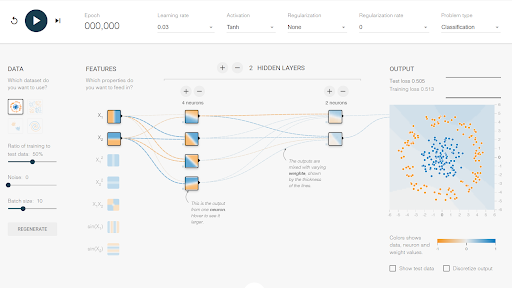
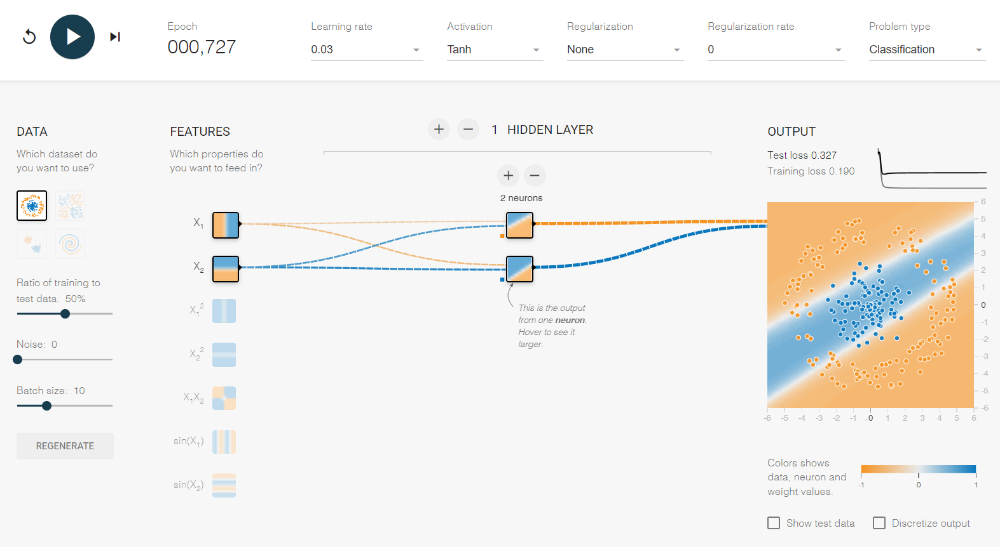

# Material de Deep Learning

Este repositorio contiene una colección de notebooks relacionados con el campo de Deep Learning.

## Contenido

El repositorio está organizado en carpetas, cada una de las cuales aborda un tema específico dentro del campo del aprendizaje profundo (Deep Learning). Algunos de los temas cubiertos incluyen:

- Introducción al Deep Learning (*01_intro_DL*)

## Ejecución de los Cuadernos

Para ejecutar los cuadernos incluidos en este repositorio, puede utilizar Google Colab, una plataforma en línea que permite ejecutar cuadernos de Jupyter de forma gratuita. Simplemente haga clic en el botón "Open In Colab" que aparece en la cabecera de todos los cuadernos. A continuación, se proporciona el enlace:

Este enlace le dirigirá a Google Colab, donde podrá abrir el cuaderno en un entorno interactivo y ejecutar el código paso a paso.

## Herramientas

### Tensorflow Playground

#### ¿Qué es TensorFlow Playground?

[TensorFlow Playground](https://playground.tensorflow.org/ "TensorFlow Playground") es una aplicación web interactiva que permite simular redes neuronales densamente conectadas directamente en el navegador, ofreciendo resultados en tiempo real. Desarrollada en JavaScript, esta herramienta facilita la comprensión de cómo funcionan las redes neuronales al permitir la manipulación de diversos parámetros y la observación inmediata de sus efectos.

Con TensorFlow Playground, puedes:

* **Configurar la arquitectura de la red** : Añadir hasta 6 capas ocultas, con un máximo de 8 neuronas por capa.
* **Visualizar métricas de rendimiento** : Observar la "Training loss" (pérdida en entrenamiento) y la "Test loss" (pérdida en pruebas) para evaluar la eficacia y generalización del modelo.

#### Interfaz de TensorFlow Playground

Aunque en la propia herramienta online tienes explicaciones de cómo se utiliza, a continuación te dejo una breve explicación de la interfaz.

  

La interfaz de TensorFlow Playground es intuitiva y está dividida en varias secciones clave:

* **Selección del conjunto de datos** : En la columna izquierda, puedes elegir entre diferentes distribuciones de datos para el entrenamiento, como "circle", "exclusive or", "Gaussian" o "Spiral". Además, es posible ajustar el porcentaje de datos destinados al entrenamiento y prueba, el nivel de ruido y la cantidad de datos por iteración.
* **Definición de la red neuronal** :
* **Features** : Propiedades de entrada que el modelo utilizará. Para ejercicios iniciales, se recomienda no usar más de dos datos de entrada.
* **Hidden Layers** : Capas de neuronas ocultas. Puedes agregar o eliminar capas y ajustar el número de neuronas en cada una.
* **Output** : Capa de salida o resultado.
* **Parámetros adicionales** : En la parte superior, puedes ajustar parámetros como la tasa de aprendizaje, la función de activación y la regularización.

#### Proceso de entrenamiento

1. **Configura la red neuronal** : Define el número de capas ocultas y el número de neuronas en cada una.
2. **Inicia el entrenamiento** : Haz clic en el botón "play" para comenzar.
3. **Observa los resultados** : Durante el entrenamiento, el fondo del área de visualización se ajustará, mostrando cómo el modelo separa las diferentes clases de datos.

Por ejemplo, con una capa oculta y dos neuronas, el modelo puede no ser capaz de separar correctamente las clases, lo que indica la necesidad de ajustar la arquitectura añadiendo más neuronas o capas adicionales.

#### Primeros pasos con TensorFlow Playground

En este video, Carlos Santana ([@DotCSV](https://twitter.com/DotCSV)) explora de manera interactiva el funcionamiento de esta herramienta visual para facilitar la comprensión de conceptos complejos en el aprendizaje profundo. Les recomiendo ver este video antes de empezar a tocar cosas con TensorFlow Playground para que tu aprendizaje sea más significativo.

### TensorBoard

[TensorBoard: Visualize your model&#39;s training metrics](https://www.tensorflow.org/tensorboard "TensorBoard Documentation")

## Enlaces de Interes

[Deep Learning by Ian Goodfellow, Yoshua Bengio, and Aaron Courville](http://www.deeplearningbook.org/ "http://www.deeplearningbook.org/")
