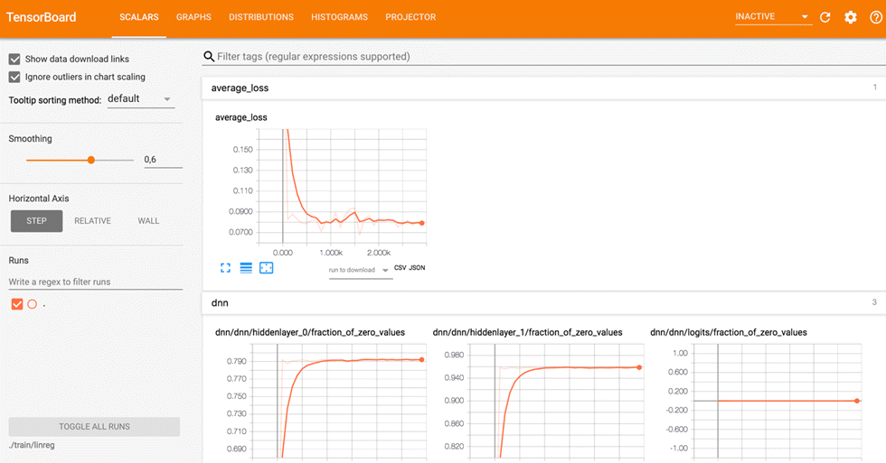
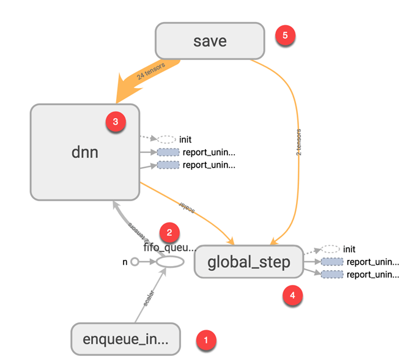
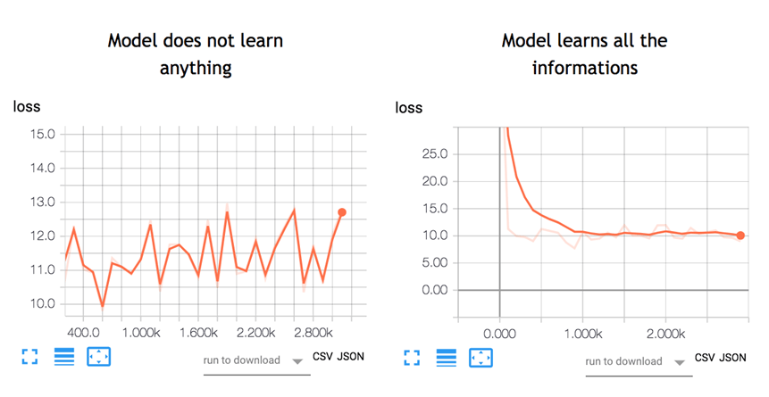
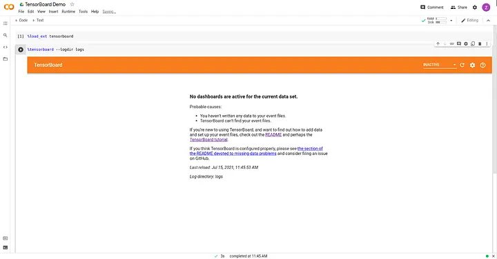

# Material de Deep Learning

Este repositorio contiene documentación (notebooks, ficheros pdf y enlaces) relacionados con el campo de Deep Learning.

## Contenido

El repositorio está organizado en carpetas, cada una de las cuales aborda un tema específico dentro del campo del aprendizaje profundo (Deep Learning). Algunos de los temas cubiertos incluyen:

- Introducción al Deep Learning (*01_intro_DL*)
- Redes Convolucionales (*02_CNN*)

## Ejecución de los Cuadernos

Para ejecutar los cuadernos incluidos en este repositorio, puede utilizar Google Colab, una plataforma en línea que permite ejecutar cuadernos de Jupyter de forma gratuita. Simplemente haga clic en el botón "Open In Colab" que aparece en la cabecera de todos los cuadernos. A continuación, se proporciona el enlace:

[](https://colab.research.google.com/your_notebook_link_here)

Este enlace le dirigirá a Google Colab, donde podrá abrir el cuaderno en un entorno interactivo y ejecutar el código paso a paso.

## Herramientas

### Tensorflow Playground

#### 1. ¿Qué es TensorFlow Playground?

[TensorFlow Playground](https://playground.tensorflow.org/ "TensorFlow Playground") es una aplicación web interactiva que permite simular redes neuronales densamente conectadas directamente en el navegador, ofreciendo resultados en tiempo real. Desarrollada en JavaScript, esta herramienta facilita la comprensión de cómo funcionan las redes neuronales al permitir la manipulación de diversos parámetros y la observación inmediata de sus efectos.

Con TensorFlow Playground, puedes:

* **Configurar la arquitectura de la red** : Añadir hasta 6 capas ocultas, con un máximo de 8 neuronas por capa.
* **Visualizar métricas de rendimiento** : Observar la "Training loss" (pérdida en entrenamiento) y la "Test loss" (pérdida en pruebas) para evaluar la eficacia y generalización del modelo.

#### 2. Interfaz de TensorFlow Playground

Aunque en la propia herramienta online tienes explicaciones de cómo se utiliza, a continuación te dejo una breve explicación de la interfaz.

<div align="center">
  
</div>

La interfaz de TensorFlow Playground es intuitiva y está dividida en varias secciones clave:

* **Selección del conjunto de datos** : En la columna izquierda, puedes elegir entre diferentes distribuciones de datos para el entrenamiento, como "circle", "exclusive or", "Gaussian" o "Spiral". Además, es posible ajustar el porcentaje de datos destinados al entrenamiento y prueba, el nivel de ruido y la cantidad de datos por iteración.
* **Definición de la red neuronal** :
* **Features** : Propiedades de entrada que el modelo utilizará. Para ejercicios iniciales, se recomienda no usar más de dos datos de entrada.
* **Hidden Layers** : Capas de neuronas ocultas. Puedes agregar o eliminar capas y ajustar el número de neuronas en cada una.
* **Output** : Capa de salida o resultado.
* **Parámetros adicionales** : En la parte superior, puedes ajustar parámetros como la tasa de aprendizaje, la función de activación y la regularización.

#### 3. Proceso de entrenamiento

1. **Configura la red neuronal** : Define el número de capas ocultas y el número de neuronas en cada una.
2. **Inicia el entrenamiento** : Haz clic en el botón "play" para comenzar.
3. **Observa los resultados** : Durante el entrenamiento, el fondo del área de visualización se ajustará, mostrando cómo el modelo separa las diferentes clases de datos.

Por ejemplo, con una capa oculta y dos neuronas, el modelo puede no ser capaz de separar correctamente las clases, lo que indica la necesidad de ajustar la arquitectura añadiendo más neuronas o capas adicionales.


#### 4. Primeros pasos con TensorFlow Playground

En este video, Carlos Santana ([@DotCSV](https://twitter.com/DotCSV)) explora de manera interactiva el funcionamiento de esta herramienta visual para facilitar la comprensión de conceptos complejos en el aprendizaje profundo. Les recomiendo ver este video antes de empezar a tocar cosas con TensorFlow Playground para que tu aprendizaje sea más significativo.

<div align="center">
  <a href="https://www.youtube.com/watch?v=FVozZVUNOOA">
    
  </a>
</div>

### TensorBoard

#### 1. ¿Qué es TensorBoard?

[TensorBoard](https://www.tensorflow.org/tensorboard) es una herramienta de visualización diseñada para proporcionar información sobre los flujos de trabajo de aprendizaje automático en TensorFlow. Permite monitorear métricas, comprender el rendimiento del modelo y depurar experimentos de machine learning de manera visual.

#### 2. Características principales de TensorBoard

En la imagen a continuación, se puede ver el panel de visualización de gráficos de TensorBoard. El panel contiene diferentes pestañas, que están vinculadas al nivel de información que agrega cuando ejecuta el modelo.

<div align="center">
  
</div>

* **Panel de Escalares (Scalars Dashboard)**: Visualiza métricas como pérdida, precisión y tasa de aprendizaje a lo largo de las épocas. Esto ayuda a identificar tendencias durante el entrenamiento y garantiza la convergencia del modelo.
* **Gráficos (Graphs):** Inspecciona y depura el gráfico computacional de tu modelo de TensorFlow. Esta característica permite comprender la estructura de modelos complejos y el flujo de tensores entre capas.
* **Histogramas:** Monitorea la distribución de pesos, sesgos u otros tensores a lo largo del tiempo. Esto ayuda a identificar problemas como gradientes que se desvanecen o explotan.
* **Imágenes:** Visualiza imágenes generadas durante el entrenamiento o la prueba, como datos de entrada, salidas reconstruidas o filtros.
* **Texto:** Muestra datos de texto, como predicciones o salidas tokenizadas, para analizar el rendimiento.
* **Visualizador de Embeddings:** Analiza datos de alta dimensionalidad, como embeddings de palabras, proyectándolos en espacios de menor dimensión (por ejemplo, 2D o 3D).
* **Ajuste de Hiperparámetros:** Visualiza el efecto de diferentes combinaciones de hiperparámetros y compara múltiples ejecuciones en un único panel.

#### 3. Visualización del modelo en TensorBoard

<div align="center">
  
</div>


El gráfico ilustra cómo funciona un modelo de red neuronal utilizando **TensorBoard** para comprender mejor el flujo de datos y operaciones. Cada paso está numerado para facilitar la interpretación:

1. **Poner en cola los datos en el modelo** :
   Los datos se envían al modelo en lotes del tamaño definido ( *batch size* ). Esto representa la cantidad de muestras que serán procesadas por el modelo en cada iteración de entrenamiento. El componente `enqueue_in` es responsable de alimentar datos desde las fuentes al sistema.
2. **Alimentar los datos al tensor FIFO** :
   Los datos entrantes son organizados y manejados mediante una cola FIFO (`fifo_queue`) para garantizar que se procesen en el orden correcto. Este paso regula la entrega eficiente de datos a la red neuronal.
3. **Entrenamiento del modelo** :
   El bloque `dnn` (Deep Neural Network) representa el corazón del modelo, donde se realizan las operaciones de entrenamiento. Durante esta etapa, el modelo ajusta sus parámetros (pesos y sesgos) para minimizar la función de pérdida, utilizando los datos provenientes de la cola FIFO.
4. **Seguimiento de las iteraciones** :
   El tensor `global_step` registra el número de lotes procesados durante el entrenamiento. Este valor puede utilizarse para monitorear el progreso y sincronizar otras operaciones relacionadas con el entrenamiento.
5. **Guardado del modelo** :
   Finalmente, los parámetros ajustados del modelo se guardan en el disco (`save`) para garantizar que puedan reutilizarse o evaluarse más tarde. Este proceso incluye guardar tensores esenciales que representan el estado actual del modelo.

#### 4. ¿En qué ayuda el uso de TensorBoard?

TensorBoard transforma las redes neuronales de "cajas negras" a sistemas visualizables y comprensibles. Esta herramienta actúa como una "linterna", proporcionando una perspectiva detallada de cómo se calculan los pesos, las dependencias entre operaciones y métricas clave como la función de pérdida.

* **Visualización en tiempo real** : TensorBoard actualiza las métricas regularmente durante el entrenamiento, lo que elimina la necesidad de esperar hasta que termine el proceso. Puedes inspeccionar el estado del modelo y realizar ajustes si algo no parece correcto.
* **Depuración y optimización** : Al observar el flujo del modelo y las métricas durante el entrenamiento, TensorBoard ayuda a identificar problemas como configuraciones incorrectas, sobreajuste o errores en los datos.

Para darles una idea de lo útil que puede ser el uso de TensorBoard, mire la siguiente imagen:

<div align="center">
  
</div>


La imagen muestra cómo el comportamiento de un modelo de red neuronal depende de la configuración adecuada de la **tasa de aprendizaje** y la  **función de pérdida** . Estos elementos son esenciales para garantizar que el modelo aprenda correctamente y alcance buenos resultados.

**¿Qué es la función de pérdida?**

La **función de pérdida** es una métrica clave que evalúa qué tan lejos están las predicciones del modelo respecto a los valores reales. El objetivo durante el entrenamiento es  **minimizar la función de pérdida** , lo que indica que el modelo está cometiendo menos errores. A medida que el entrenamiento progresa, se espera que la pérdida disminuya hasta estabilizarse en una línea plana, lo cual sugiere que el modelo ha encontrado una solución adecuada.

**El rol de la tasa de aprendizaje**

La **tasa de aprendizaje** controla la velocidad a la que el modelo ajusta sus parámetros durante el entrenamiento. Configurar este valor correctamente es crucial:

1. **Tasa de aprendizaje demasiado alta** **(gráfico de la izquierda):**
   La línea de pérdida sube y baja de manera errática sin mostrar una disminución clara. Esto indica que el modelo está aprendiendo de manera inestable, sin tiempo suficiente para ajustar correctamente sus parámetros. En este caso, las predicciones son el resultado de conjeturas aleatorias, y el modelo no aprende nada útil.
2. **Tasa de aprendizaje adecuada (gráfico de la derecha):**
   La línea de pérdida muestra una disminución progresiva durante las iteraciones, hasta estabilizarse en un valor bajo. Esto significa que el modelo está aprendiendo de manera eficiente, ajustando sus parámetros correctamente y logrando una solución óptima.

#### 5. Cómo usar TensorBoard en Google Colab

* **Cargar la extensión en el Notebook**

```bash
%load_ext tensorboard
```

* **Inicia TensorBoard**

Ejecuta el servidor de TensorBoard y señala el directorio de registros:

```bash
%tensorboard --logdir logs
```


<div align="center">
  
</div>


#### 6. Consejos para un uso efectivo

* **Organiza los directorios de registros**: Usa directorios separados para diferentes experimentos para evitar sobrescribir registros.
* **Compara experimentos**: Inicia TensorBoard con múltiples directorios de registro para comparar experimentos.
* **Minimiza el registro innecesario:** Evita registrar datos excesivos para prevenir ralentizaciones.
* **Para obtener un modelo efectivo**:

  * Diseña una arquitectura adecuada para la red neuronal (número de capas y neuronas por capa).
  * Configura una función de pérdida que permita evaluar las predicciones del modelo.
  * Ajusta la tasa de aprendizaje para garantizar un aprendizaje estable y progresivo.

## Enlaces de Interes

[Deep Learning by Ian Goodfellow, Yoshua Bengio, and Aaron Courville](http://www.deeplearningbook.org/ "http://www.deeplearningbook.org/")

[Neural Networks and Deep Learning By Michael Nielsen](http://neuralnetworksanddeeplearning.com/ "http://neuralnetworksanddeeplearning.com/")

Funciones de Activación:

* [Deep Sparse Rectifier Neural Networks by Xavier Glorot,  Antoine Bordes, Yoshua Bengio](https://proceedings.mlr.press/v15/glorot11a/glorot11a.pdf "https://proceedings.mlr.press/v15/glorot11a/glorot11a.pdf")

Funciones de Coste:

* [A list of cost functions used in neural networks, alongside applications](https://stats.stackexchange.com/questions/154879/a-list-of-cost-functions-used-in-neural-networks-alongside-applications "https://stats.stackexchange.com/questions/154879/a-list-of-cost-functions-used-in-neural-networks-alongside-applications")

Optimizadores:

* [Understanding Deep Learning Optimizers: Momentum, AdaGrad, RMSProp & Adam](https://towardsdatascience.com/understanding-deep-learning-optimizers-momentum-adagrad-rmsprop-adam-e311e377e9c2)

Redes Neuronales

* [A Neural Network in 11 lines of Python (Part 1)](https://iamtrask.github.io/2015/07/12/basic-python-network/ "https://iamtrask.github.io/2015/07/12/basic-python-network/")
* [A Neural Network in 13 lines of Python (Part 2 - Gradient Descent)](https://iamtrask.github.io/2015/07/27/python-network-part2/ "https://iamtrask.github.io/2015/07/27/python-network-part2/")

TensorFlow

* [Instructivos de TensorFlow](https://www.tensorflow.org/tutorials "https://www.tensorflow.org/tutorials")

TensorBoard

* [Empiece a utilizar TensorBoard](https://www.tensorflow.org/tensorboard/get_started "https://www.tensorflow.org/tensorboard/get_started")
* [Deep Dive Into TensorBoard: Tutorial With Examples](https://neptune.ai/blog/tensorboard-tutorial "https://neptune.ai/blog/tensorboard-tutorial")
* [Tensorboard Tutorial: The Ultimate Guide](https://zito-relova.medium.com/tensorboard-tutorial-5d482d270f08 "https://zito-relova.medium.com/tensorboard-tutorial-5d482d270f08")
* [Entendiendo un modelo de regresión lineal con TensorBoard](https://adictosaltrabajo.com/2020/12/18/entendiendo-un-modelo-de-regresion-lineal-con-tensorboard/ "https://adictosaltrabajo.com/2020/12/18/entendiendo-un-modelo-de-regresion-lineal-con-tensorboard/")

Keras 3

* [Documentación](https://keras.io/keras_3/ "https://keras.io/keras_3/")
* [API](https://keras.io/api/ "https://keras.io/api/")

SciKeras

* [Documentación](https://www.adriangb.com/scikeras/ "https://www.adriangb.com/scikeras/")
* [Repositorio](https://github.com/adriangb/scikeras "https://github.com/adriangb/scikeras")
* [PyPi](https://pypi.org/project/scikeras/ "https://pypi.org/project/scikeras/")
* [Use Keras Deep Learning Models with Scikit-Learn in Python](https://machinelearningmastery.com/use-keras-deep-learning-models-scikit-learn-python/ "https://machinelearningmastery.com/use-keras-deep-learning-models-scikit-learn-python/")

Formato para guardar modelos
* [ONNX](https://onnx.ai/)

Redes Convolucionales

* [Convolutional Neural Networks for Visual Recognition](https://cs231n.github.io/convolutional-networks/)
* [The History of Convolutional Neural Networks for Image Classification (1989 - Today)](https://towardsdatascience.com/the-history-of-convolutional-neural-networks-for-image-classification-1989-today-5ea8a5c5fe20)
* [2D Visualization of a Convolutional Neural Network](https://adamharley.com/nn_vis/cnn/2d.html)
* [Image Kernels Explained Visually](https://setosa.io/ev/image-kernels/)
* [Convolution arithmetic](https://github.com/vdumoulin/conv_arithmetic)
* [WaveNet: A generative model for raw audio](https://deepmind.google/discover/blog/wavenet-a-generative-model-for-raw-audio/)

Redes Recurrentes

* [Long Short-Term Memory](http://bioinf.jku.at/publications/older/2604.pdf)
* [Understanding LSTM Networks](https://colah.github.io/posts/2015-08-Understanding-LSTMs/)
* [Learning long-term dependencies with gradient descent is difficult](https://www.comp.hkbu.edu.hk/~markus/teaching/comp7650/tnn-94-gradient.pdf)
* [On the difficulty of training recurrent neural networks](https://proceedings.mlr.press/v28/pascanu13.pdf)
* [Understanding LSTM and its diagrams](https://blog.mlreview.com/understanding-lstm-and-its-diagrams-37e2f46f1714)
* [The Unreasonable Effectiveness of Recurrent Neural Networks](https://karpathy.github.io/2015/05/21/rnn-effectiveness/)
* [Visualizing and Understanding Recurrent Networks](https://arxiv.org/abs/1506.02078)
* [LSTM: A Search Space Odyssey](https://arxiv.org/abs/1503.04069)
* [Neural Machine Translation by Jointly Learning to Align and Translate](https://arxiv.org/abs/1409.0473)
* [Learning Phrase Representations using RNN Encoder–Decoder for Statistical Machine Translation](https://arxiv.org/pdf/1406.1078v3)

Procesamiento del Lenguaje Natural

* [How Google's Knowledge Graph works](https://support.google.com/knowledgepanel/answer/9787176)
* [Knowledge Representation & NLP in AI](https://www.tutorialride.com/artificial-intelligence/knowledge-representation-nlp-in-ai.htm)
* [Natural Language Processing and Machine Learning](https://insights.encora.com/insights/natural-language-processing-and-machine-learning)
* [Deep Belief Networks — all you need to know](https://icecreamlabs.medium.com/deep-belief-networks-all-you-need-to-know-68aa9a71cc53)
* [A Brief History of Natural Language Processing — Part 1](https://medium.com/@antoine.louis/a-brief-history-of-natural-language-processing-part-1-ffbcb937ebce)
* [A Brief History of Natural Language Processing — Part 2](https://medium.com/@antoine.louis/a-brief-history-of-natural-language-processing-part-2-f5e575e8e37)
* [Attention Is All You Need](https://arxiv.org/abs/1706.03762)
* [Illustrated Guide to Transformer](https://jinglescode.github.io/2020/05/27/illustrated-guide-transformer/)
* [Illustrated Guide to Transformers- Step by Step Explanation](https://towardsdatascience.com/illustrated-guide-to-transformers-step-by-step-explanation-f74876522bc0)
* [Step-by-Step Illustrated Explanations of Transformer](https://medium.com/the-modern-scientist/detailed-explanations-of-transformer-step-by-step-dc32d90b3a98)
* [Efficient Estimation of Word Representations in Vector Space](https://arxiv.org/pdf/1301.3781)
* [BERT: Pre-training of Deep Bidirectional Transformers for Language Understanding](https://arxiv.org/abs/1810.04805)
* [Deep contextualized word representations](https://arxiv.org/abs/1802.05365)
